## Description

## Summary

**I've built bidirectional workspace sync with cloud storage** and would like to land it properly. The implementation is complete, tested, and I've been running it on my Fly.io Gateway with Dropbox — it works great.

This proposal outlines a plan to break #3505 (closed for size) into smaller, reviewable PRs.

```mermaid
flowchart TB
    subgraph local["🖥️ Local Machine"]
        direction LR
        localFolder["~/Dropbox/moltbot/"]
        localApp["Native cloud app<br/>(Dropbox/GDrive/OneDrive)"]
        localFolder <--> localApp
    end

    subgraph cloud["☁️ Cloud Provider"]
        cloudStorage["Dropbox / Google Drive / OneDrive / S3 / R2 + 70 more"]
    end

    subgraph remote["🌐 Remote Gateway (Fly/VPS)"]
        direction LR
        rclone["rclone bisync<br/>(background sync)"]
        remoteFolder["&lt;workspace&gt;/shared/"]
        rclone <--> remoteFolder
    end

    localApp <--> cloudStorage
    cloudStorage <--> rclone

    style local fill:#e8f5e9,stroke:#4caf50
    style cloud fill:#e3f2fd,stroke:#2196f3
    style remote fill:#fff3e0,stroke:#ff9800
```



**Use case:** Drop a file locally → it appears on the remote Gateway (and vice versa). Zero LLM cost for background sync.

---

## Implementation status

**The implementation is complete and working.** I've been running this on my remote Gateway (Fly.io + Dropbox) and it works great. The code in #3505 includes:

- ✅ 23 unit tests passing
- ✅ Cross-platform tested (macOS, Linux, Windows path handling)
- ✅ Tested live with Dropbox bisync on Fly.io
- ✅ Lint passes (`pnpm lint`)
- ✅ Build passes (`pnpm build`)

This proposal is purely about **process** — breaking the working implementation into reviewable PRs per maintainer feedback.

---

## Proposed approach

Use [rclone](https://rclone.org/) as the sync engine:
- **70+ cloud providers** supported out of the box
- **Bisync mode** for bidirectional sync with conflict resolution
- **Battle-tested** — widely used, well-documented
- **Zero runtime cost** — pure file operations, no LLM tokens

---

## Component dependency graph


---

## Components

I'll submit these as **4 sequential PRs**, each building on the previous:

### PR 1: Foundation (~730 lines)

| File | Purpose |
|------|---------|
| `src/config/types.workspace.ts` | **Config schema** — TypeScript types for `workspace.sync` config block. Defines provider options (dropbox, gdrive, onedrive, s3, custom), sync paths, intervals, conflict resolution, and provider-specific settings (S3 endpoint/bucket, Dropbox app folder). |
| `src/infra/rclone.ts` | **rclone wrapper** — Core infrastructure for all sync operations. Includes: binary detection/installation prompts, config file generation from moltbot.json credentials, OAuth authorization flow, `bisync` (bidirectional) and `sync` (one-way) operations, remote listing, connection health checks. |

**Value:** Foundational infrastructure. No user-facing changes yet, but enables everything else.

---

### PR 2: CLI Commands (~750 lines)

| File | Purpose |
|------|---------|
| `src/cli/workspace-cli.ts` | **CLI interface** — Registers `moltbot workspace` command group with subcommands |

**Subcommands:**

| Command | Description |
|---------|-------------|
| `moltbot workspace setup` | Interactive wizard — checks/installs rclone, selects provider, configures OAuth, runs first sync |
| `moltbot workspace sync` | Manual sync — bidirectional by default, supports `--direction pull\|push`, `--resync`, `--dry-run` |
| `moltbot workspace status` | Health check — shows provider config, rclone status, remote connection, auto-sync settings |
| `moltbot workspace authorize` | OAuth flow — standalone authorization for manual setup |
| `moltbot workspace list` | List remote files |

**Value:** **Usable feature!** After this PR, users can sync their workspace manually.

---

### PR 3: Auto-sync (~740 lines)

| File | Purpose |
|------|---------|
| `src/hooks/bundled/workspace-sync/handler.ts` | **Session hooks** — Auto-syncs on session start/end. Runs during existing agent activity (no extra LLM cost). |
| `src/gateway/workspace-sync-manager.ts` | **Background sync manager** — Runs rclone bisync at configured intervals. Pure file operation (zero LLM tokens). Features: auto-resync on first run, stale lock cleanup, 60s minimum interval. |

**Value:** "Set and forget" sync. Configure once, files stay in sync automatically.

---

### PR 4: Documentation (~500 lines)

| File | Purpose |
|------|---------|
| `docs/gateway/workspace-sync.md` | **Full documentation** — Quick start, config reference, provider setup, CLI reference, troubleshooting, security notes |
| `skills/workspace-sync/SKILL.md` | **Agent skill** — Enables the agent to help users with sync issues |

**Value:** Users can self-serve setup and troubleshooting.

---

## Configuration example

```json
{
  "workspace": {
    "sync": {
      "provider": "dropbox",
      "remotePath": "moltbot-share",
      "localPath": "shared",
      "interval": 300,
      "onSessionStart": true,
      "onSessionEnd": false,
      "dropbox": {
        "appFolder": true,
        "appKey": "your-app-key",
        "appSecret": "your-app-secret",
        "token": "${DROPBOX_TOKEN}"
      }
    }
  }
}
```

---

## Alternatives considered

| Approach | Pros | Cons |
|----------|------|------|
| **rclone** (proposed) | 70+ providers, battle-tested, bisync | External optional dependency |
| Native SDKs per provider | No external deps | Massive maintenance burden |
| rsync over SSH | Simple | Requires SSH access, no cloud providers |
| Git-based sync | Built-in | Not suitable for binary files |

---

## Open questions

1. **Dependency policy:** Is adding rclone as an optional runtime dependency acceptable? (Users install separately or via the setup wizard — not bundled)
2. **PR cadence:** Should I wait for each PR to merge before submitting the next, or can I open them as a stacked series?
3. **Scope concerns:** Any hesitation about the background sync manager (PR 3), or is CLI-only (PRs 1-2) preferred for v1?

---

## Security considerations

- Tokens stored in rclone.conf (standard rclone security model)
- Dropbox app-folder mode recommended for scoped access (limited blast radius)
- Default excludes: `.git/**`, `node_modules/**`, `.env*`, `*.log`
- Documentation covers security best practices

---

Looking forward to feedback on the approach. Happy to adjust the PR breakdown based on maintainer preferences.

/cc @sebslight

## Comments

### @ashbrener (2026-01-29)

**Related Discussion:** #3509 (moved to Ideas category)

The discussion has more context on the original implementation and use cases.

### @Lulubags (2026-01-29)

Outstanding 


## Links

- None detected yet
