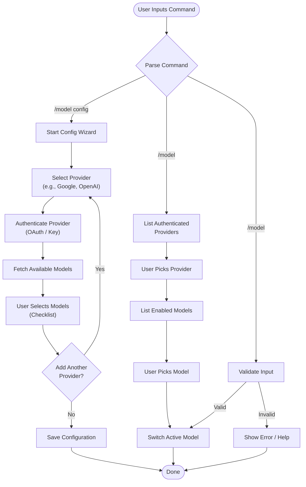

## Description

# Feature Request: Interactive Model Picker for Moltbot

## Summary
The current model selection system in Moltbot/Clawdbot is brittle and user-hostile. Users are forced to memorize complex, raw model ID strings and manually edit configuration files. This creates high cognitive load.

## Proposed solution
Implement a unified `/model` command with three distinct modes of operation.

### Workflow (Step-by-Step)

**Path 1: Configuration (`/model config`)**
1.  **Start Wizard** → Select Provider (e.g., Google, OpenAI)
2.  **Authenticate** → Enter API Key or OAuth
3.  **Fetch & Select** → System lists models; User checks boxes (☑️ Gemini Pro, ☑️ Flash)
4.  **Loop?** → "Add another provider?" (Yes/No)
5.  **Save** → Store configuration

**Path 2: Visual Menu (`/model`)**
1.  **List Providers** → User picks "1. Google"
2.  **List Models** → User picks "2. Gemini Flash"
3.  **Switch** → System updates active model

**Path 3: Power User (`/model provider model`)**
1.  **Type Command** → `/model openai 5.2`
2.  **Instant Switch** → No menus, just switches

### Workflow Diagram

### 1. Configuration (Setup)
**Command:** `/model config`
A looping wizard for building your library of models.
1.  **Select Provider:** (e.g., Google, Anthropic, OpenAI)
2.  **Authenticate:** Perform OAuth or enter key for that provider.
3.  **Select Models:** Present a checklist of available models from that provider. The system should fetch the latest model list dynamically.
    *   *Example:* ☑️ Gemini 3 Pro, ☑️ Gemini 3 Flash
4.  **Loop or Finish:** System asks: *"Add another provider?"*
    *   **Yes:** Loops back to Step 1 (e.g., to add Anthropic → Opus 4.5).
    *   **No:** Exits and saves configuration.

### 2. Interactive Selection (Visual)
**Command:** `/model` (no arguments)
For users who prefer a visual menu.
1.  **List Providers:** Shows authenticated providers (e.g., 1. Google, 2. Anthropic, 3. OpenAI).
2.  **List Models:** User picks a provider, system lists available models.
    *   *Example:* 1. Gemini 3 Pro, 2. Gemini 3 Flash
    *   *Example:* 1. Opus 4.5, 2. Sonnet 4.5
    *   *Example:* 1. ChatGPT 5.2
3.  **Select:** User picks a number to switch.

### 3. Direct Selection (Power User)
**Command:** `/model <provider> <model>`
For users who know what they want.
*   Example: `/model openai 5.2`
*   Example: `/model anthropic opus`
*   Instantly switches without menus.

## Alternatives considered
-   **Model Aliases:** Defining static aliases like `coding` or `fast`.
-   **Status Quo:** Relying on raw config edits.

## Additional context
The goal is to support both "visual" users and "power" users, while ensuring the system always presents **current** model names (like Gemini 3 Pro, Opus 4.5, ChatGPT 5.2) rather than outdated defaults.

## Comments

## Links

- None detected yet
