## Description

# Demo

### Running
```bash
./scripts/deploy/google/compute-engine/run.sh \
  --project MY_GOOGLE_PROJECT_ID \
  --env-file .env \
  --tailscale \
  --telegram-user-id MY_TELEGRAM_ID
```

https://github.com/user-attachments/assets/587aa624-09e6-4ab0-9b2e-899ae2790074


### After deploy

https://github.com/user-attachments/assets/5cbd8b0f-ed7f-4ab7-832e-8b114d21b10d

### As Developer

https://github.com/user-attachments/assets/fcdd65a0-5357-42a2-8357-10c241e19aef


## Summary
- Add automated deployment script for GCP Compute Engine (`scripts/deploy/google/compute-engine/run.sh`)
- Add uninstall script for clean removal
- Add comprehensive README with Mermaid diagrams
- Update `docs/platforms/gcp.md` with automated deployment section

Based on the manual steps documented in [docs/platforms/gcp.md](https://github.com/moltbot/moltbot/blob/main/docs/platforms/gcp.md)

## Architecture Overview

```mermaid
graph TB
    subgraph You["👤 YOU (user)"]
        Laptop["💻 Laptop<br/>(browser)"]
        Phone["📱 Phone<br/>(Telegram)"]
        Tablet["📱 Tablet<br/>(browser)"]
    end

    subgraph GCP["☁️ GOOGLE CLOUD PLATFORM"]
        subgraph VM["🖥️ VM (Compute Engine)<br/>Debian 12, 4GB RAM"]
            subgraph Docker["🐳 DOCKER"]
                Gateway["🤖 MOLTBOT GATEWAY<br/>(port 18789)<br/>─────────────<br/>• Receives Telegram messages<br/>• Processes with Claude AI<br/>• Responds automatically<br/>• Web UI for config"]
            end
            subgraph Volumes["📁 Mounted Volumes"]
                Config["~/.clawdbot/<br/>(config, tokens)"]
                Workspace["~/clawd/<br/>(agent workspace)"]
            end
        end
    end

    Laptop -->|"HTTPS<br/>(Tailscale)"| Gateway
    Phone -->|"Telegram API"| Gateway
    Tablet -->|"HTTPS<br/>(Tailscale)"| Gateway
    Gateway --> Config
    Gateway --> Workspace
```



## What the script does automatically

```mermaid
flowchart TD
    Start["🚀 run.sh --project X --tailscale --telegram-user-id Y"] --> Step1

    subgraph Step1["Step 1: Verification"]
        V1["✓ gcloud CLI installed?"]
        V2["✓ Authenticated on GCP?"]
        V3["✓ Project has billing?"]
    end

    Step1 --> Step2

    subgraph Step2["Step 2: Create VM"]
        VM1["Create e2-medium (4GB RAM)"]
        VM2["Install Docker"]
        VM3["Configure firewall"]
    end

    Step2 --> Step3

    subgraph Step3["Step 3: Configure Moltbot"]
        C1["Clone repository"]
        C2["Create .env with keys"]
        C3["Auto-generate tokens"]
    end

    Step3 --> Step4

    subgraph Step4["Step 4: Build & Start"]
        B1["docker compose build"]
        B2["docker compose up -d"]
        B3["Verify stability (3 checks)"]
    end

    Step4 --> Step5

    subgraph Step5["Step 5: Tailscale"]
        T1["Install Tailscale"]
        T2["Authenticate (link in terminal)"]
        T3["Configure HTTPS Serve"]
    end

    Step5 --> Step6

    subgraph Step6["Step 6: Telegram"]
        TG1["Set dmPolicy = allowlist"]
        TG2["Add your user ID"]
    end

    Step6 --> Result["✅ DONE!<br/>URL: https://moltbot-gateway.tailnet-xxx.ts.net<br/>Telegram: Message @YourBot!"]
```



## Features
- **Tailscale integration** for secure HTTPS access (via `--tailscale` flag)
- **Telegram auto-approval** via `--telegram-user-id` flag (skips manual pairing)
- **Telegram bot token** via `--telegram-token` or `--env-file` with `TELEGRAM_BOT_TOKEN`
- **Container stability checks** with auto-restart on failure
- **Automatic gateway configuration** (`allowInsecureAuth` for browser access)
- **Multiple AI provider support** (Anthropic, OpenAI)
- **Quick access URL** shown at end of deployment with token included

## Usage

### Install
```bash
# Basic deployment (SSH tunnel access)
./scripts/deploy/google/compute-engine/run.sh \
  --project YOUR_PROJECT_ID \
  --anthropic-key sk-ant-[REDACTED]

# With Tailscale HTTPS + Telegram (recommended)
./scripts/deploy/google/compute-engine/run.sh \
  --project YOUR_PROJECT_ID \
  --env-file .env \
  --tailscale \
  --telegram-user-id YOUR_TELEGRAM_USER_ID
```

### Uninstall
```bash
# Delete VM and firewall rule (complete removal)
./scripts/deploy/google/compute-engine/uninstall.sh --project YOUR_PROJECT_ID

# Delete VM but keep firewall rule for future deployments
./scripts/deploy/google/compute-engine/uninstall.sh --project YOUR_PROJECT_ID --keep-firewall
```

**What gets deleted:**
- VM instance (`moltbot-gateway`)
- Firewall rule (`moltbot-gateway`) - unless `--keep-firewall` is used
- All data on the VM (config, workspace, Docker images)

**What is NOT deleted:**
- Your GCP project
- Billing account
- Other resources in the project

## Test plan
- [x] Test fresh deployment on new GCP project
- [x] Test with `--env-file` flag (includes TELEGRAM_BOT_TOKEN)
- [x] Test with `--telegram-user-id` flag
- [x] Test Telegram plugin auto-enable
- [x] Test uninstall script
- [x] Test with `--tailscale` flag (Tailscale Serve)

## Reviews


## Comments


## Stats

- **Size:** huge (1781+, 0-, 4 files)
- **Age:** 0 days
- **Last activity:** 2026-01-30

## Links

- Fixes: (none detected)
