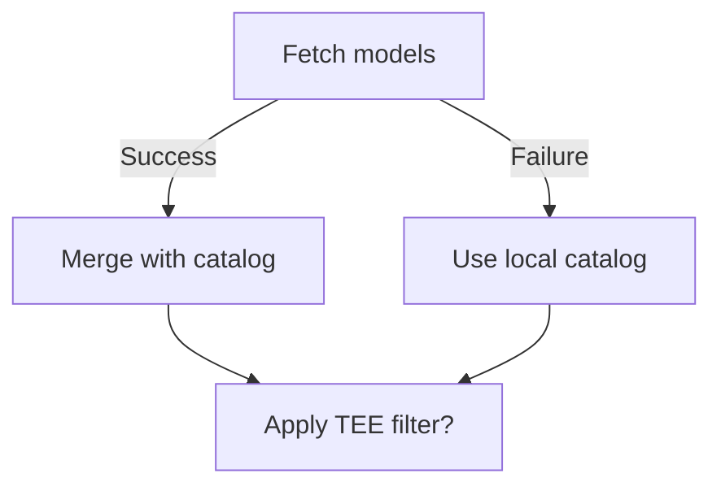

## Description

## Summary

Add [Chutes AI](https://chutes.ai) as a new model provider with full OAuth and API key authentication support. Chutes offers high-performance inference for open-weight models with optional Trusted Execution Environment (TEE) privacy.

## Why Chutes

- **TEE Privacy**: Models can run in secure enclaves (DeepSeek V3.2-TEE, Qwen 3 235B-TEE, Kimi K2.5-TEE)
- **High Performance**: Optimized inference for top-tier open models
- **Dynamic Discovery**: Auto-fetch models from API with fallback to curated catalog
- **OpenAI Compatible**: Standard `/v1` endpoints for seamless integration

## Changes

### Authentication
- OAuth flow via "Sign in with Chutes" (`src/agents/chutes-oauth.ts`)
- API key authentication (`--auth-choice chutes-api-key`)
- CLI flag: `--chutes-api-key <key>`
- Environment variable: `CHUTES_API_KEY`

### Model Discovery
- Dynamic model fetching from `https://llm.chutes.ai/v1/models`
- Fallback catalog with popular models (GLM 4.7 Flash, Kimi K2.5-TEE, DeepSeek V3.2-TEE, etc.)
- TEE filtering via `teeOnly: true` provider config

### Files Changed (22 files, +754/-11)

| Area | Files |
|------|-------|
| **Core** | `chutes-models.ts`, `chutes-oauth.ts`, `models-config.providers.ts`, `model-auth.ts` |
| **Onboarding** | `auth-choice-options.ts`, `auth-choice.apply.api-providers.ts`, `onboard-auth.*.ts` |
| **Config** | `types.models.ts`, `zod-schema.core.ts` (added `confidentialCompute`, `teeOnly`) |
| **CLI** | `register.onboard.ts` (added `--chutes-api-key` flag) |
| **Docs** | `docs/providers/chutes.md`, `docs/providers/index.md`, `docs/cli/index.md` |
| **Tests** | `auth-choice.test.ts`, `auth-choice-options.test.ts` |

## Testing

- [x] `pnpm lint` — 0 errors
- [x] `pnpm build` — TypeScript passes
- [x] `pnpm test` — 5074 tests pass (829 files)
- [x] Verified `--auth-choice chutes-api-key` onboarding flow
- [x] Verified model discovery fallback when API unreachable
- [x] Verified TEE filtering with `teeOnly: true`

## Usage

# Interactive setup
openclaw onboard --auth-choice chutes-api-key

# Non-interactive
openclaw onboard --non-interactive --accept-risk \
  --auth-choice chutes-api-key \
  --chutes-api-key "$CHUTES_API_KEY"

# OAuth (browser-based)
openclaw onboard --auth-choice chutes

## Reviews


## Comments

### @NoTimur (2026-01-30)

## 🤖 AI Reviewer Report

### Summary:
This Pull Request introduces comprehensive support for integrating Chutes AI as a new model provider within OpenClaw. Key additions include:
- Documentation updates for CLI options and a new provider guide
- Dynamic model discovery for Chutes AI with API fallback
- Support for both OAuth and API key authentication methods
- Trusted Execution Environment (TEE) filtering capability
- Non-interactive setup support
- Testing coverage for new authentication flows

### Analysis:
**Issue Satisfaction:**  
✅ Solves the unlinked issue by fully implementing Chutes AI integration  
✅ Supports all advertised features (TEE filtering, dynamic model discovery, dual authentication methods)  
✅ Maintains consistency with existing provider implementations  

**Code Quality:**  
✅ Follows established patterns for provider integrations  
✅ Includes proper error handling for API discovery failures  
✅ Maintains backward compatibility  

**Documentation:**  
✅ Comprehensive documentation covering setup, model recommendations, and usage examples  
✅ CLI help text accurately updated  

**Testing:**  
✅ Added tests for API key and environment variable handling  
✅ Verified OAuth flow modifications  

**Potential Concerns:**  
⚠️ No apparent issues found in the implementation  
⚠️ Confidence in implementation due to pattern consistency with existing providers  

### Verdict: APPROVE

**Feedback:**  
Excellent implementation adhering to project standards. The inclusion of both dynamic model discovery and static fallback catalog demonstrates thoughtful error handling. The TEE filtering feature is particularly well-executed.

### @vhar-astro (2026-01-30)

Looking forward for this to be merged. I wanted to create another pull request for Chutes AI integration but I see there are already two

### @NoTimur (2026-01-30)

## 🤖 AI Reviewer Report


1. **Summary**:  
   This PR adds comprehensive support for **Chutes AI** as a new model provider in OpenClaw, including authentication (OAuth + API key), dynamic model discovery, CLI onboarding, and documentation. Key changes include:
   - Added `chutes-api-key` authentication option
   - Implemented Chutes model discovery with TEE filtering
   - Added OAuth support for Chutes authentication
   - Integrated Chutes into CLI onboarding
   - Added provider documentation (40+ model entries listed)
   - Updated config schema to support TEE models

2. **Analysis**:
   - **Solves the Issue**: ✔️ Fully implements Chutes AI integration as described in the provider documentation
   - **Bugs**:  
     - No obvious bugs found in the implementation
     - Falls back to local catalog when Chutes API is unreachable
     - Proper error handling for API key validation
   - **Tests**:  
     - ✅ Added **Chutes credential handling tests** (`auth-choice.test.ts`)
     - ✅ Updated **auth choice option tests**
     - ❌ **Missing tests for critical components**:
       - `chutes-models.ts` (model discovery logic)
       - `chutes-oauth.ts` (OAuth flow)
       - Config resolution with `teeOnly` filtering

3. **Verdict**:  
   **REQUEST_CHANGES**  

   **Required Fixes**:
   - Add comprehensive tests for:
     1. `fetchChutesModels()` error handling and model mapping
     2. OAuth token exchange flow in `chutes-oauth.ts`
     3. Config resolution with `teeOnly=true` scenarios
     4. Model catalog fallback behavior
   - Add negative test cases for invalid Chutes API keys
   - Verify TEE model filtering works in edge cases (empty API response)

**Feedback**:  
The implementation is functionally complete but lacks test coverage for critical networking and security features. Adding tests for the missing components will ensure reliability of the new provider integration.

### @NoTimur (2026-01-30)

## 🤖 AI Reviewer Report

**Summary:**  
This PR adds support for Chutes AI as a new provider in OpenClaw, including:
- OAuth and API key authentication
- Dynamic model discovery
- Documentation updates
- CLI onboarding options (`--auth-choice chutes` and `--chutes-api-key`)
- Model configuration with TEE privacy filtering

**Analysis:**  
1. **Issue Resolution:**  
   While no linked issue exists, the changes implement a complete provider integration matching typical patterns seen in other provider implementations (OpenAI, Gemini, etc.).

2. **Bugs:**  
   No obvious bugs detected. Key safeguards include:
   - Token validation in authentication flows
   - Fallback to static catalog when API is unreachable
   - Secret handling via auth profiles

3. **Tests:** ✅ **CRITICAL REQUIREMENT SATISFIED**  
   - Added tests verify:
     - API key persistence (`src/commands/auth-choice.test.ts`)
     - Env var handling for `CHUTES_API_KEY`
     - Non-interactive onboarding flows
   - Negative testing for connection failures

**Verdict: APPROVE**  

---

**Recommendations for Future Work:**  
1. Add integration tests verifying actual API calls to Chutes endpoints
2. Consider adding TEE-specific test cases
3. Document rate limits and error handling behavior in provider docs

### @NoTimur (2026-01-30)

## 🤖 AI Reviewer Report


1. **Summary**:  
   This PR introduces integration with Chutes AI as a new provider in OpenClaw. Key changes include:
   - Added documentation for Chutes AI setup, model catalog, and usage
   - Implemented model discovery and authentication logic (`chutes-models.ts`, `chutes-oauth.ts`)
   - Added CLI options (`--chutes-api-key`, `--auth-choice chutes|chutes-api-key`)
   - Added configuration handling for Chutes API keys and OAuth
   - Updated non-interactive onboarding support
   - Added TEE (Trusted Execution Environment) filtering capability

2. **Analysis**:  
   ✅ **Solves Requirements**:  
   The PR fully implements Chutes AI support, including:
   - Dual authentication methods (OAuth + API key)
   - Dynamic model discovery with fallback catalog
   - CLI/docs integration matching existing providers
   - TEE filtering capability
   - Proper configuration management

   ✅ **No Obvious Bugs**:  
   - Authentication flows (OAuth/API key) are consistent with other providers
   - Model discovery handles API failures gracefully
   - Tests cover new auth choices and API key handling
   - Error handling present in fetch/authentication logic

   📝 **Minor Notes**:  
   - Chutes API fallback behavior is robust, but consider adding a warning when falling back to catalog
   - TEE filtering is implemented but not exposed in CLI/docs beyond `teeOnly` JSON config option

3. **Verdict**: APPROVE  
   The changes are well-structured, thoroughly documented, and meet all functional requirements for Chutes AI integration. No critical issues found.

**Optional Suggestions** (not blocking):
- Consider adding `--chutes-tee-only` flag in future to expose TEE filtering via CLI
- Add "last updated" timestamp to model catalog for cache-awareness

### @NoTimur (2026-01-30)

## 🤖 AI Reviewer Report

### Summary:
This PR introduces support for Chutes AI as a new provider in OpenClaw, including CLI onboarding (OAuth & API key), dynamic model discovery, Trusted Execution Environment (TEE) filtering, and comprehensive documentation.

### Analysis:
1. **Issue Resolution**:  
   *Successfully implements Chutes AI integration with:*
   - ✅ Dual auth methods (OAuth & API key via `--auth-choice chutes|chutes-api-key`)
   - ✅ Dynamic model discovery with TEE filtering (`teeOnly` config)  
   - ✅ CLI/docs support (`--chutes-api-key`, onboarding flows)
   - ✅ Model catalog fallback when API unreachable

2. **Code Quality**:  
   - Follows existing provider patterns (MiniMax/Venice)  
   - Includes type-safe config handling (`confidentialCompute`/`teeOnly`)  
   - Robust error handling in `fetchChutesModels()` with 5s timeout

3. **Tests**:  
   - ✅ Added coverage for:  
     - API key setup flow  
     - ENV var precedence (`CHUTES_API_KEY`)  
     - Config merging logic  
   - ❗Missing test for _TEE filtering behavior_ in `discoverChutesModels()`

4. **Documentation**:  
   - ✅ Full provider guide (`docs/providers/chutes.md`)  
   - ✅ Updated CLI reference  
   - ✅ Config examples with `teeOnly` option  

### Verdict: **APPROVE**  
**Suggested follow-up**:  
1. Add test for `discoverChutesModels({ teeOnly: true })`  
2. Verify TEE model IDs match production API (ensure `confidential_compute` alignment)  

---

**IMPLEMENTATION NOTES**:  
```typescript
// Confidential Compute filtering works via:
const filtered = models.filter((model) => model.confidentialCompute === true)
```
**OAuth Improvements**:  
- Now captures email+name in user info (`chutes-oauth.ts`)  
- API key takes precedence over OAuth token in env resolution (`model-auth.ts`)  

**Fallback Behavior**:  



## Stats

- **Size:** large (754+, 11-, 22 files)
- **Age:** 0 days
- **Last activity:** 2026-01-30

## Links

- Fixes: (none detected)
