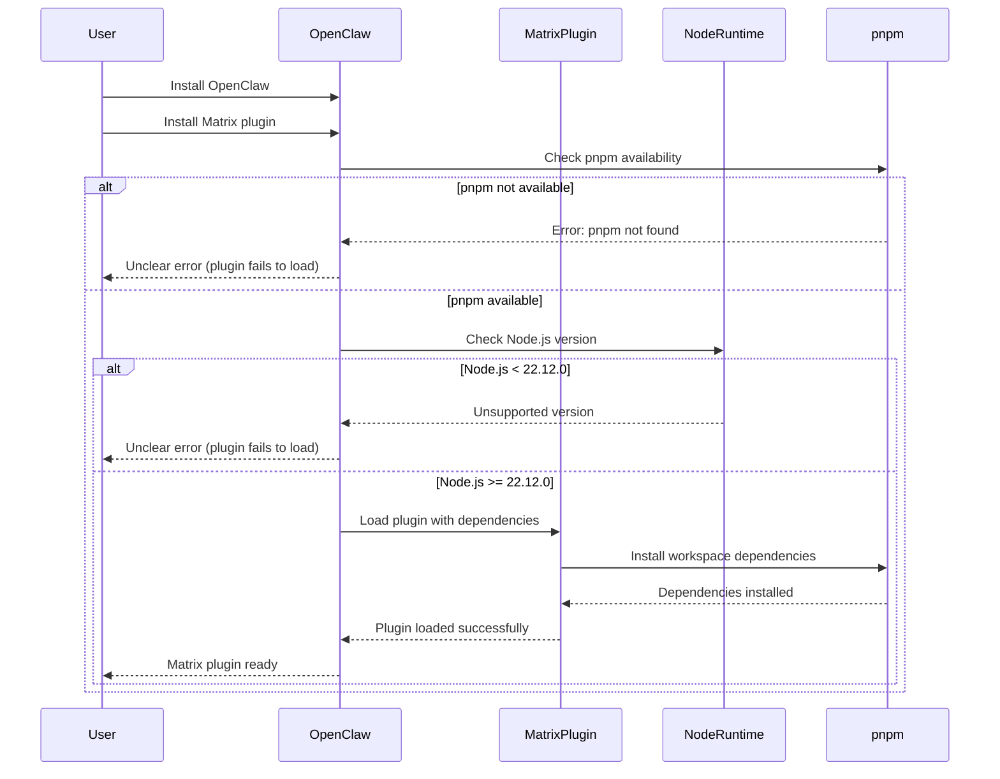

## Description

### Summary
Clarifies the environment requirements for running the Matrix plugin.

### Context
The Matrix extension already declares its dependencies, but running OpenClaw
with unsupported Node.js versions or without pnpm causes the plugin to fail
to load with unclear errors.

### Changes
- Documented required Node.js version (>= 22.12.0)
- Clarified pnpm workspace requirement

Fixes #5292

## Reviews

### @greptile-apps — COMMENTED (2026-01-31)

1 file reviewed, 4 comments

[Edit Code Review Agent Settings](https://app.greptile.com/review/github) | [Greptile](https://greptile.com?utm_source=greptile_expert&utm_medium=github&utm_campaign=code_reviews)

## Comments

### @greptile-apps (2026-01-31)

<h2>Greptile Overview</h2>

<h3>Greptile Summary</h3>

This PR adds documentation clarifying the environment requirements for OpenClaw and the Matrix plugin. It addresses issue #5292 by documenting that Node.js >= 22.12.0 and pnpm are required, which matches the `engines` field in `package.json:153`.

**Key changes:**
- Added new "Environment Requirements" section explaining Node.js >= 22.12.0 and pnpm requirements
- Clarified that running with unsupported versions causes Matrix plugin to fail with unclear errors
- Added two blank lines before "Runtime: **Node ≥22**." in the install section

**Potential improvements:**
- The new section placement (after quick start examples) creates an awkward flow - consider moving it earlier
- "workspace install required" phrasing is ambiguous about when pnpm is actually needed
- Trailing whitespace at line 83
- Two unnecessary blank lines added at lines 44-45

The documentation accurately reflects the technical requirements and will help users avoid the plugin loading errors mentioned in the issue.

<h3>Confidence Score: 4/5</h3>

- Safe to merge with minor documentation style improvements recommended
- The PR correctly documents the Node.js version requirement matching package.json engines field and addresses a real user pain point. The content is accurate and helpful, though the section placement and some phrasing could be improved. No functional code changes, only documentation additions.
- No files require special attention - all changes are documentation improvements to README.md

<h3>Important Files Changed</h3>

| Filename | Overview |
|----------|----------|
| README.md | Added environment requirements section clarifying Node.js >= 22.12.0 and pnpm requirements for Matrix plugin |

<h3>Sequence Diagram</h3>

### @Deep-27 (2026-01-31)

The failing CI check appears to be unrelated to this PR.

This PR only changes documentation (README.md). The failure is in
`src/docker-setup.test.ts`, where the test expects a literal `"gateway"`
string, but the generated docker-compose output uses structured YAML
(`openclaw-gateway` with `command: ['node', 'dist/index.js', 'gateway', ...]`).

No Docker or test-related files were modified in this PR.
Happy to re-run checks or let maintainers decide how to proceed.

### @joshuafhiggins (2026-01-31)

This does not fix #5292 and may not be needed, are you sure anything in OpenClaw actually requires Node 22.12?

## Stats

- **Size:** small (10+, 1-, 1 files)
- **Age:** 2 days
- **Last activity:** 2026-01-31

## Links

- Fixes: #5292
